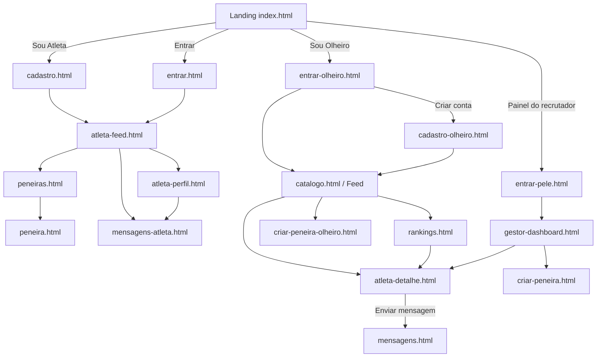

# ScoutX — Fluxos e Arquitetura (Sprint 2 · Frontend Design)

> Documentação dos três fluxos principais, listagem de componentes por página
> e fluxograma de navegação. Projeto: **ScoutX — a rede social do futebol de base**
> (Challenge Pelé Academia · FIAP).

O ScoutX tem **três personas** com áreas próprias, e cada uma corresponde a um
**fluxo principal**:

1. **Atleta** (jovem da base) — se mostrar e ser descoberto com segurança.
2. **Olheiro** (recrutador externo, assinante) — descobrir talento e iniciar contato.
3. **Recrutador Pelé** (equipe interna) — operar a descoberta e as peneiras.

A entrada de todos é a **landing** (`index.html`), que direciona para a
autenticação de cada perfil. Todo contato com o atleta é **intermediado pela
plataforma** (o responsável legal é sempre avisado) — princípio que aparece em
todos os fluxos.

---

## Mapa de telas

| Área | Telas (arquivos) |
|---|---|
| Pública | `index.html` (landing) |
| Autenticação | `entrar.html`, `entrar-olheiro.html`, `entrar-pele.html`, `cadastro.html`, `cadastro-olheiro.html` |
| Atleta | `app/atleta-feed.html`, `app/atleta-perfil.html`, `app/peneiras.html`, `app/peneira.html`, `app/mensagens-atleta.html` |
| Olheiro | `app/catalogo.html` (feed), `app/atleta-detalhe.html`, `app/rankings.html`, `app/criar-peneira-olheiro.html`, `app/mensagens.html` |
| Recrutador Pelé | `app/gestor-dashboard.html`, `app/criar-peneira.html` |
| Design System | `componentes.html` |

---

## Fluxo 1 — Atleta: "ser descoberto com segurança"

**Perfil do usuário.** Jovem de 11 a 17 anos do futebol de base, menor de idade,
acompanhado pelo responsável legal. Quer visibilidade para olheiros sem se expor
a risco. Acessa majoritariamente pelo **celular**.

**Tarefa principal.** Criar o perfil (com o responsável), publicar vídeos de lances
e entrar no radar de olheiros e peneiras — sem que ninguém fale direto com ele.

**Caminho principal (happy path).**
1. `index.html` → portal **"Sou Atleta"**.
2. `cadastro.html` → preenche dados do atleta **e do responsável** + aceite (LGPD/ECA) → **Criar conta**.
3. `app/atleta-feed.html` → vê o resumo da semana (weekbar), o feed da comunidade e os destaques.
4. `app/atleta-perfil.html` → a "Carta do Atleta", características da comunidade, números verificados e **Enviar vídeo**.
5. `app/peneiras.html` → `app/peneira.html` → inscrição em peneira (presencial/online).
6. `app/mensagens-atleta.html` → recebe interesse **intermediado**, com o responsável acompanhando.

**Caminhos alternativos.**
- Atleta que já tem conta: `index.html` → **Entrar** → `entrar.html`.
- Do feed, pode ir direto a Peneiras ou Mensagens pela barra de navegação.
- No celular, abrir uma conversa abre a tela cheia de chat (voltar retorna à lista).

**Pontos de falha / tratamento.**
- Campos obrigatórios e aceite do responsável **não preenchidos** → estado `error` do campo (`.field--error` + `.field__error`).
- Conta de menor **não confirmada pelo responsável** → conta criada mas inativa (aviso `.auth-note`).
- Olheiro tentando contato direto → **bloqueado**; só há canal intermediado (mensagem de segurança no chat).

---

## Fluxo 2 — Olheiro: "descobrir e iniciar contato"

**Perfil do usuário.** Recrutador/agente/clube externo, **assinante**. Quer filtrar
talentos por região/posição/idade, avaliar vídeos e iniciar conversa segura. Usa
desktop e celular.

**Tarefa principal.** Encontrar um atleta no feed/rankings, abrir o perfil detalhado
e **enviar uma mensagem intermediada**.

**Caminho principal.**
1. `index.html` → portal **"Sou Olheiro"** → `entrar-olheiro.html` (login) ou **Criar conta de olheiro** (`cadastro-olheiro.html`, com verificação).
2. `app/catalogo.html` (Feed) → navega posts, destaques e filtros.
3. `app/atleta-detalhe.html` → características, números, tração na comunidade.
4. **Enviar mensagem** → modal de confirmação (`:target`, sem JS) → `app/mensagens.html` (conversa intermediada).
5. Apoio: `app/rankings.html` (rankings por categoria) e `app/criar-peneira-olheiro.html` (clube parceiro cria seletiva).

**Caminhos alternativos.**
- Pelo cabeçalho do post (avatar/nome) também se chega ao perfil do atleta.
- Rankings → "Ver" leva ao detalhe do atleta.
- Selo "Plano Pro" indica a assinatura ativa.

**Pontos de falha / tratamento.**
- Olheiro **não verificado** → navega o catálogo, mas falar com atletas exige conta verificada (aviso no cadastro).
- Tentativa de pegar telefone/contato pessoal → **bloqueada** pela plataforma (mensagem de sistema no chat).
- Conta sem assinatura → acesso limitado (modelo de planos, fora do escopo da Sprint).

---

## Fluxo 3 — Recrutador Pelé: "operar a descoberta e as peneiras"

**Perfil do usuário.** Equipe interna da Pelé Academia (coordenação de recrutamento).
Acesso **por convite** (sem cadastro público). Quer enxergar tendências antes do
mercado, intermediar contatos e organizar peneiras.

**Tarefa principal.** Acompanhar o radar de talentos em alta e **criar uma peneira**.

**Caminho principal.**
1. `index.html` → rodapé **"Acesse o painel do recrutador"** → `entrar-pele.html` (acesso interno).
2. `app/gestor-dashboard.html` → KPIs do mês, **Radar de tendências** (Vantagem Pelé), intermediação de contatos e receita (assinaturas + solidariedade).
3. `app/criar-peneira.html` → monta a seletiva (categoria, formato, data, vagas, capa) com prévia.

**Caminhos alternativos.**
- Dashboard → "Atletas" (radar) e "Intermediação" (âncoras na própria tela).
- Do radar, "Priorizar/Acompanhar" leva ao detalhe do atleta.

**Pontos de falha / tratamento.**
- Acesso sem convite → não há cadastro público (aviso em `entrar-pele.html`).
- Receita sempre **sem taxa por participação** — só assinaturas e solidariedade dos atletas que a Pelé forma (nota no painel).

---

## Componentes por página (nomenclatura do design system)

> Componentes-base do design system: `.app-bar` / `.app-nav`, `.btn` (+`--gold/--outline/--ghost/--danger`),
> `.input` / `.select` / `.textarea` / `.field`, `.card`, `.carta` (composto), `.badge`, `.alert`,
> `.chip-toggle`, `.avatar`, `.skip-link`.

**`index.html` (landing):** `.masthead`, `.btn--gold`/`--ghost`, `.carta` (hero), `.chip-feat`, `.portal`, `.step`, `.selo`.

**`cadastro.html` / `cadastro-olheiro.html`:** `.app-bar`, `.auth-card`, `.field` + `.input`/`.select`, `.chip-toggle`, `.auth-check`, `.auth-note`, `.btn--gold`.

**`entrar*.html`:** `.app-bar`, `.auth-card`, `.field` + `.input`, `.btn--gold`/`--outline`, `.auth-foot`.

**`app/atleta-feed.html`:** `.app-bar` + `.app-nav`, `.weekbar`, `.composer`, `.feed-tabs`, `.stories`/`.story`, `.igpost` (header + mídia + ações + legenda), `.igtags`, `.rail-card`.

**`app/atleta-perfil.html`:** `.profile-head` + `.carta` (composto), `.kpi`, `.progress`, `.selos`/`.selo`, `.viz-card`, `.tagcloud`/`.tag-c`, `.statgrid`, `.media-grid`/`.media-tile`, `.msg`.

**`app/catalogo.html` (feed olheiro):** `.app-bar`, `.discover`, `.feed-tabs`, `.stories`, `.igpost`, `.igbar`/`.igact`, `.rail-card`, `.plan-pill`.

**`app/atleta-detalhe.html`:** `.profile-head` + `.carta`, `.detail-cta` + `.btn`, `.viz-card`, `.statgrid`, `.tagcloud`, `.modal` (`:target`), `.flow-step`.

**`app/rankings.html`:** `.rank-tabs` (`.rank-tab`), `.rank-filters` + `.select`, `.podium`/`.pod`, `.ranklist`/`.rankrow`, `.btn--outline--sm`.

**`app/mensagens.html` / `mensagens-atleta.html`:** `.msgs`, `.msg-list`/`.msg-list__item`, `.msg-thread` (`:target` em mobile), `.msg-safe`, `.bubble` (`--in/--out/--sys`), `.msg-compose`.

**`app/criar-peneira.html` / `criar-peneira-olheiro.html`:** `.create-grid`, `.form-section`, `.field` + `.input`/`.select`, `.chip-toggle`, `.upload-cover`, prévia (`.pen-preview`), `.btn--gold`.

**`app/gestor-dashboard.html`:** `.app-bar`, `.kpi-band`/`.kpi`, `.panel` (+`--alert`), `.list-row`, `.ret-val`, `.btn--gold/--outline`, `.rev-total`.

**`app/peneiras.html` / `peneira.html`:** `.pen-feature`, `.peneira` (card), `.pen-hero`, `.pen-stats`, `.pen-callout`, `.flow-step`, `.btn--gold`.

**`componentes.html`:** vitrine do design system (todos os componentes acima com os 6 estados).

---

## Fluxograma de navegação

Diagrama em Mermaid (renderizável no GitHub / Mermaid Live):

Descrição em texto (caso o Mermaid não renifique no leitor):

- **Landing** distribui para 3 entradas: *Sou Atleta* → cadastro; *Sou Olheiro* → login do olheiro; *Painel do recrutador* → login interno da Pelé. Há também **Entrar** (login do atleta).
- **Atleta:** cadastro/entrar → **feed** → (perfil ⇄ peneiras → peneira) e (mensagens).
- **Olheiro:** login/cadastro → **feed (catálogo)** → detalhe do atleta → **mensagens**; rankings também leva ao detalhe; pode criar peneira (clube parceiro).
- **Pelé:** login interno → **dashboard** → criar peneira; do radar do dashboard chega ao detalhe do atleta.
- A barra inferior (mobile) / superior (desktop) permite circular entre as telas de cada área.
